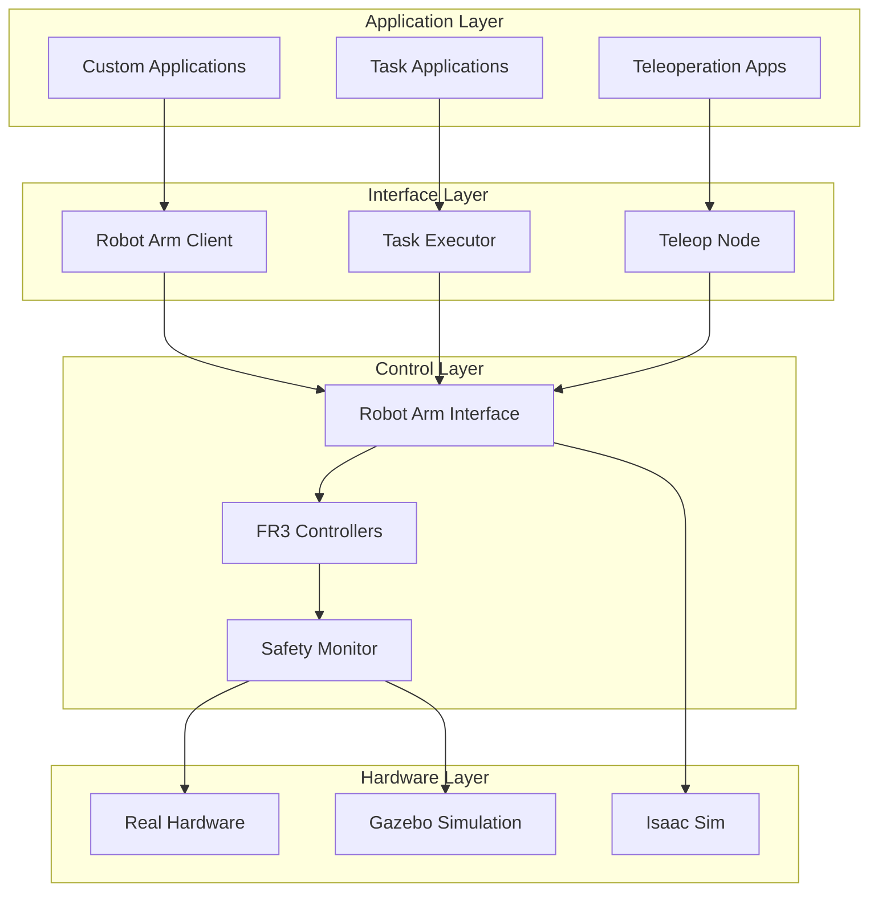
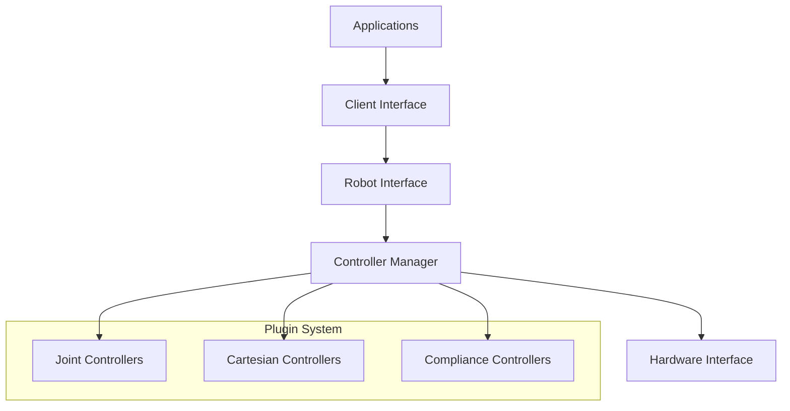
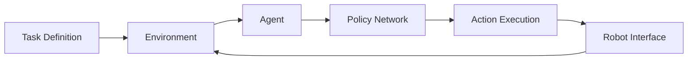
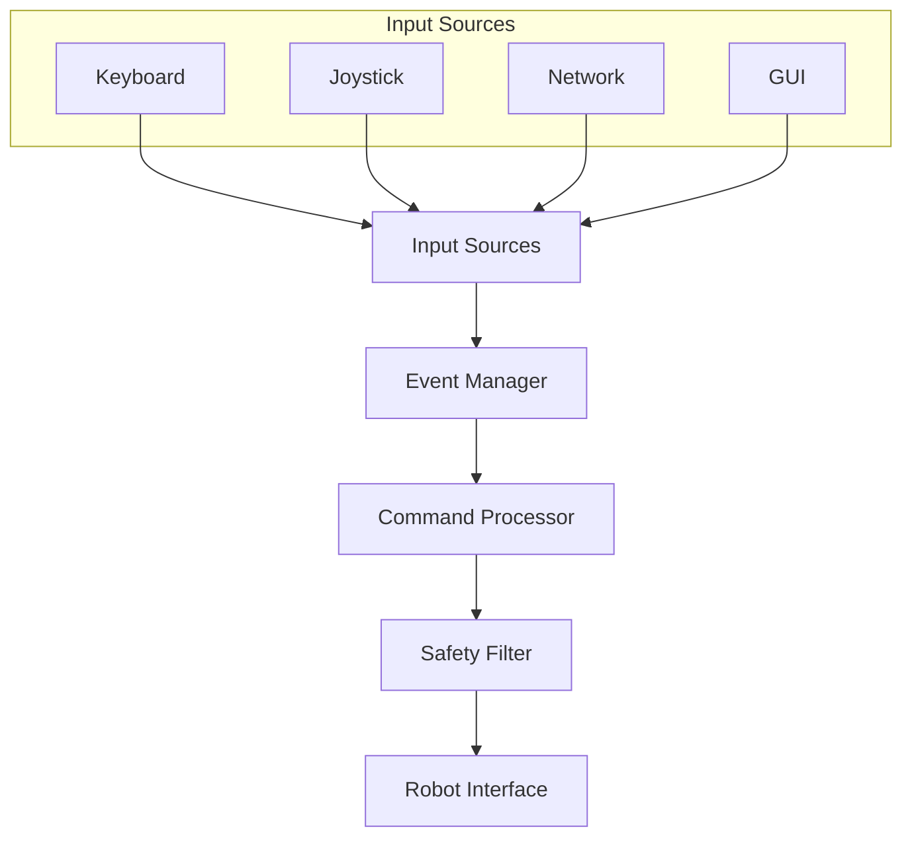
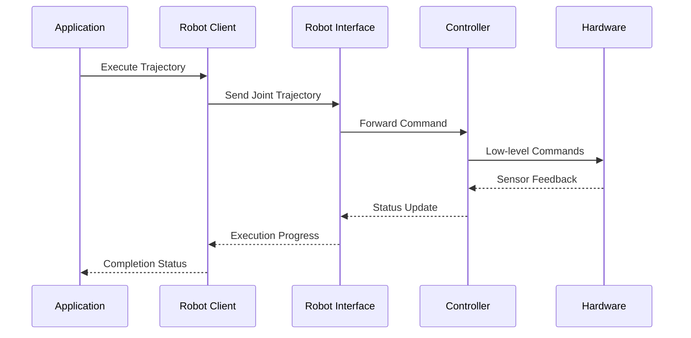
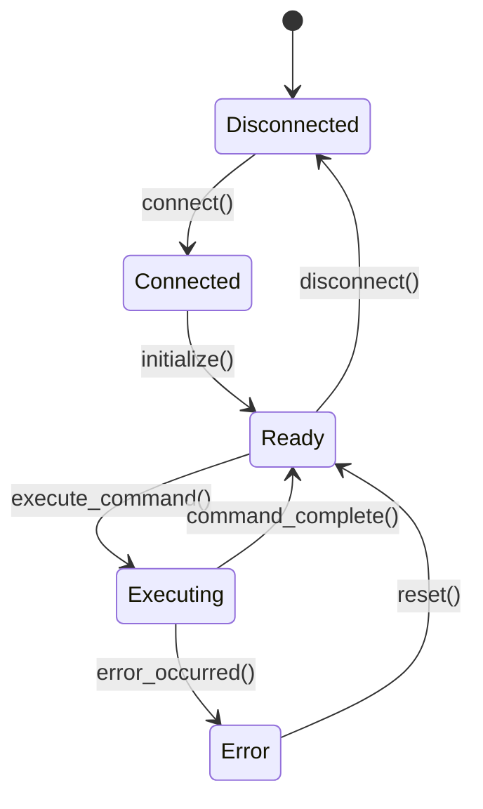

# System Architecture

This document describes the overall architecture and design principles of the ADG ROS2 system.

## High-Level Architecture

The ADG ROS2 system follows a layered architecture with clear separation of concerns:



## Core Design Principles

### 1. Modularity
Each package has a well-defined responsibility and clean interfaces:

- **Single Responsibility**: Each package focuses on one primary function
- **Loose Coupling**: Minimal dependencies between packages  
- **High Cohesion**: Related functionality is grouped together

### 2. Abstraction Layers
Clear abstraction boundaries enable flexibility:

- **Hardware Abstraction**: Same interface for real and simulated robots
- **Algorithm Abstraction**: Pluggable controllers and planners
- **Communication Abstraction**: Consistent ROS2 interfaces

### 3. Safety First
Safety is integrated at every level:

- **Hardware Safety**: Emergency stops and hardware limits
- **Software Safety**: Command validation and monitoring
- **System Safety**: Timeout detection and recovery

### 4. Real-Time Capabilities
Support for time-critical operations:

- **Deterministic Control**: Real-time controllers with guaranteed timing
- **Priority Management**: Critical tasks get higher priority
- **Resource Isolation**: Separate threads/processes for different concerns

## Package Architecture

### Core Utilities (`adg_ros2_utils`)

**Purpose**: Shared functionality across all packages

**Components**:
- Debug utilities for remote debugging
- Common data structures and helpers
- Logging and monitoring utilities

**Design Pattern**: Utility/Helper pattern

### Robot Arm System

**Purpose**: Complete robot arm control stack

**Architecture**: Layered with plugin system



**Key Patterns**:
- **Strategy Pattern**: Pluggable controllers
- **Adapter Pattern**: Hardware abstraction
- **Observer Pattern**: Status monitoring

### Task System (`robot_tasks`)

**Purpose**: High-level task execution with learning

**Architecture**: Component-based with RL integration



**Key Patterns**:
- **Template Method**: Common task execution flow
- **Factory Pattern**: Task and environment creation
- **State Pattern**: Task execution states

### Teleoperation (`teleop`)

**Purpose**: Remote robot control

**Architecture**: Multi-input event-driven system



**Key Patterns**:
- **Command Pattern**: Input command abstraction
- **Chain of Responsibility**: Safety filtering
- **Publish-Subscribe**: Event handling

## Communication Architecture

### ROS2 Integration

The system leverages ROS2's communication primitives:

**Topics**: High-frequency data streams
- Sensor data: `/joint_states`, `/robot_status`
- Commands: `/joint_commands`, `/cartesian_commands`

**Services**: Request-response operations
- Configuration: `/set_controller_parameters`
- Status queries: `/get_robot_status`

**Actions**: Long-running operations
- Trajectory execution: `/follow_joint_trajectory`
- Task execution: `/execute_task`

### Message Flow



## Data Flow Architecture

### Control Flow

1. **Command Generation**: Applications generate high-level commands
2. **Command Processing**: Commands are validated and processed
3. **Safety Checking**: All commands pass through safety filters
4. **Execution**: Low-level controllers execute commands
5. **Feedback**: Status and sensor data flows back up

### Data Types

**Command Data**:
- Joint positions/velocities
- Cartesian poses/twists
- Task specifications
- Safety parameters

**Feedback Data**:
- Joint states and sensor readings
- Execution status and progress
- Error conditions and diagnostics
- Performance metrics

## State Management

### System States

The system maintains several state machines:

**Robot State**:
- `DISCONNECTED`: No hardware connection
- `CONNECTED`: Hardware connected but not ready
- `READY`: Ready for commands
- `EXECUTING`: Executing commands
- `ERROR`: Error condition requiring attention

**Task State**:
- `IDLE`: No active task
- `PLANNING`: Planning task execution
- `EXECUTING`: Task in progress
- `COMPLETED`: Task finished successfully
- `FAILED`: Task execution failed

**Safety State**:
- `SAFE`: All systems normal
- `WARNING`: Minor safety concerns
- `EMERGENCY`: Emergency stop activated
- `FAULT`: System fault requiring reset

### State Transitions



## Error Handling and Recovery

### Error Classification

**Hardware Errors**:
- Communication failures
- Sensor errors
- Motor faults
- Emergency stop activation

**Software Errors**:
- Invalid commands
- Planning failures
- Timeout conditions
- Resource exhaustion

**System Errors**:
- Configuration errors
- Initialization failures
- Network problems
- Resource conflicts

### Recovery Strategies

**Automatic Recovery**:
- Retry with backoff for transient errors
- Fallback to safe states
- Restart failed components

**Manual Recovery**:
- User intervention for critical errors
- System reset procedures
- Hardware maintenance required

## Scalability and Performance

### Horizontal Scaling

**Multi-Robot Support**:
- Each robot runs in separate ROS2 domain
- Central coordination node manages fleet
- Shared task queue with load balancing

**Distributed Processing**:
- Computation can be distributed across machines
- GPU acceleration for ML workloads
- Edge computing for low-latency control

### Performance Optimization

**Real-Time Control**:
- RT kernel for deterministic timing
- Memory pre-allocation to avoid GC
- CPU affinity for critical threads

**Communication Optimization**:
- Message compression for network efficiency
- Zero-copy transport where possible
- Priority-based message routing

## Security Considerations

### Access Control

**Authentication**:
- Certificate-based authentication for network access
- User roles and permissions
- Audit logging of all actions

**Network Security**:
- Encrypted communication channels
- VPN for remote access
- Firewall rules for port access

### Safety-Security Integration

**Fail-Safe Design**:
- Safety systems independent of security
- Multiple redundant safety channels
- Hardware-based emergency stops

## Configuration Management

### Hierarchical Configuration

```
global_config.yaml          # System-wide settings
├── robot_config.yaml       # Robot-specific settings
├── task_config.yaml        # Task-specific settings
└── user_config.yaml        # User preferences
```

### Configuration Validation

All configuration files are validated against schemas:

```yaml
# Example schema
robot_config:
  type: object
  required: [joint_names, joint_limits]
  properties:
    joint_names:
      type: array
      items: {type: string}
    joint_limits:
      type: object
```

## Monitoring and Diagnostics

### System Health Monitoring

**Metrics Collection**:
- Performance metrics (latency, throughput)
- Resource usage (CPU, memory, network)
- Error rates and failure patterns

**Alerting**:
- Real-time alerts for critical conditions
- Escalation procedures for serious issues
- Integration with monitoring systems

### Debugging Support

**Introspection**:
- Runtime state inspection
- Message flow tracing
- Performance profiling

**Remote Debugging**:
- Attach debugger to remote nodes
- Real-time variable inspection
- Breakpoint support in production

## Future Architecture Considerations

### Planned Improvements

**Microservices Architecture**:
- Decompose monolithic nodes into microservices
- API gateway for external access
- Service mesh for communication

**Cloud Integration**:
- Cloud-based computation for ML training
- Edge-cloud hybrid deployment
- Scalable storage for training data

**AI/ML Integration**:
- Federated learning across robot fleet
- Continuous learning from deployment
- Model versioning and A/B testing

This architecture provides a solid foundation for the current system while enabling future growth and evolution.
