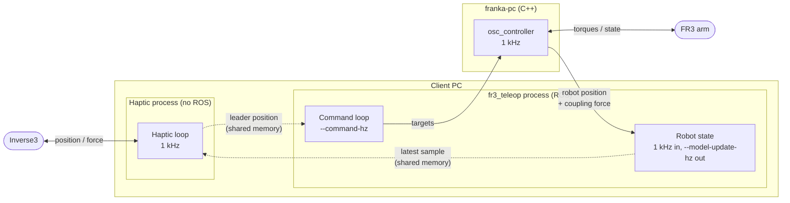

# Haptic Teleoperation

`fr3_haptic` drives the real FR3 from a Haply Inverse3 using the rendering methods of
`haptic_teleop` (ZOH, linear, TDPA, RIM, fixed-mass) from
[adl-python](https://github.com/Applied-Dynamics-Lab/adl-python). The code is in
`python/fr3_haptic/`; the roadmap is in `python/fr3_haptic/PLAN.md`.

## Architecture



| Loop | Rate | Runs in | Job |
|---|---|---|---|
| Haptic loop | 1 kHz | its own process, no ROS | Reads the handle, runs the rendering method, writes the force back. |
| Robot state | receives 1 kHz, passes on `--model-update-hz` | `fr3_teleop` | Robot → haptic: receives every controller tick, passes one per model update to the haptic process. |
| RIM model loop | `--rim-update-hz` (≤ model update) | `fr3_teleop` | Robot → haptic, `proxy-rim` only: recomputes the dynamics model. |
| Command loop | `--command-hz` | `fr3_teleop` | Haptic → robot: streams the targets to the robot. |
| `osc_controller` | 1 kHz | franka-pc | Moves the robot toward the target through a spring-damper. |

The haptic loop runs in a separate process (`haptic_teleop.HapticProcess`) so that nothing the
ROS side does can slow it down: decoding 1 kHz robot topics in Python takes the interpreter lock,
which dropped the haptic rate to 650–850 Hz when both shared one process. The two processes
exchange only the latest values (leader state one way, plant sample the other) through shared
memory. Both ROS links are topics over the network.

## What the robot is sent

The method family decides what the plant loop streams:

| Methods | Target sent to `osc_controller` | Who runs the coupling spring |
|---|---|---|
| `zoh`, `linear`, `tdpa-zoh`, `tdpa-linear` | the handle's position and velocity | `osc_controller`, with its interface-axis gains set to the coupling `kv`, `dv` |
| `proxy-rim`, `proxy-fixed-mass` | the proxy's position and velocity, plus a feedforward force | the proxy, simulated in the haptic loop at 1 kHz |

## Delays

Each link can carry a simulated delay, a base value plus jitter, set in the `delays` section of
the config (or the flags):

| Link | Flags |
|---|---|
| feedback, robot → haptic | `--feedback-delay-ms`, `--feedback-jitter-ms` |
| command, haptic → robot | `--command-delay-ms`, `--command-jitter-ms` |
| both | `--jitter-dist uniform` (base ± jitter) or `normal` (σ = jitter), clipped at 0; `--delay-seed` |

The delay is applied where each link starts: robot samples (and the RIM model) before they reach
the haptic process, targets before they are published. A link is a stream of latest values: an
item overtaken by a newer one (variable delay) is dropped, never delivered after it. Freezing the
robot is not delayed and drops every target still in flight.

With a delay, the staleness watchdog watches the time since the last *delivery* (the link went
silent), not the sample age, which now includes the delay. The startup warns if the jitter could
space deliveries close to `--plant-max-age-ms`. The seed is logged, and so is every delivery
(`feedback_link`, `command_link` streams), so a delayed run can be reproduced and plotted.

## Running

```bash
# Forces off: the arm follows the handle along z
pixi run -e humble fr3_teleop --conf python/fr3_haptic/configs/teleop.yaml

# With force feedback, another method, saving the run
pixi run -e humble fr3_teleop --conf python/fr3_haptic/configs/teleop.yaml --method linear --force --save
```

Needs franka-server running with `osc_controller`, the colcon overlay sourced, and Haply's Inlet
service. Every flag can be set in the YAML; `--force`, `--home` and `--save` are CLI-only.

## Logged data

With `--save`, each run writes one MCAP file (`samples.mcap`) and `metadata.json` (all flags,
controller gains, hold pose, git commit) under `--output-dir`. Streams:

| Stream | Rate | Content |
|---|---|---|
| `haptic` | 1 kHz | handle position/velocity on the interface axis, rendered force, plant age, energy, guard and watchdog state |
| `plant` | `--model-update-hz` | robot interface position/velocity, coupling force, EE position, task force |
| `command` | `--command-hz` | targets sent to the robot (position, velocity, feedforward force) |
| `robot_state` | `--robot-log-hz` (50) | every numeric field of `FrankaRobotState`: measured/desired joint state, motor state, external torque and wrench estimates, EE poses, inertias, errors, ... |
| `joint_torques_cmd`, `task_error`, `task_wrench`, `ee_state` | `--robot-log-hz` | `osc_controller` outputs |

Robot-side streams are recorded at a reduced rate on purpose: decoding one `FrankaRobotState`
in Python takes ~0.4 ms of the interpreter lock the 1 kHz haptic loop needs, so only the kept
messages are decoded. Timestamps of `plant` and the robot-side streams are local receive times
since the start of the run; the controller's own stamp is the `t_s` column.

To plot a run (tracking, timing and safety, joint torques, end-effector), with a printed summary:

```bash
pixi run -e humble fr3_plot                     # latest run
pixi run -e humble fr3_plot <run_dir> --figs tracking,torques --t0 2 --t1 8
pixi run -e humble fr3_plot <run_dir> --save    # PNGs in <run_dir>/plots
```

The MCAP file also opens directly in Foxglove.

!!! warning "Safety"
    - Forces are off unless `--force`, and fade in over the first second.
    - If the robot's state stops arriving for more than `plant_max_age_ms`, the handle force fades
      out, the robot holds its position, and the run ends.
    - The first target is the robot's current position, read from `osc_controller` itself.
