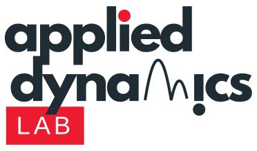

    

# ADL ROS2 Documentation

Welcome to the **Applied Dynamics Lab ROS2** documentation! 
This guide covers all the ROS2 packages developed by the McGill Applied Dynamics Lab for robotic systems, 
particularly focusing on the Franka Research 3 and teleoperation.

## Overview
The ADL ROS2 ecosystem consists of several packages:

- **[Robot Arm](packages/robot-arm.md)**: Complete robot arm control system including interfaces, controllers, and bringup
- **[Robot Tasks](packages/robot-tasks.md)**: Task execution framework with reinforcement learning capabilities
- **[Teleop](packages/teleop.md)**: Teleoperation system for remote robot control

## Quick Start

1. **Getting Started**: Check out the [getting started guide](user-guide/getting-started.md)
2. **Installation**: For steps on how to setup the robots and PCs, follow the [installation guide](user-guide/installation.md)
3. **Examples**: Explore the [tutorials](tutorials/index.md) (To Come...)

## User Guides
Documentation and user guides of each packages.

- **[Installation](user-guide/installation.md)**
- **[Getting Started](user-guide/getting-started.md)**
- **[Franka Server](user-guide/franka-server.md)**
- **[Experiments](user-guide/experiments.md)**
- **[DelayRIM](user-guide/delay-rim.md)**

## Key Features
- 🦾 **Robot Arm Control**: Complete control stack for Franka FR3 robot
- 🤖 **RL Integration**: Reinforcement learning task execution
- 🎮 **Teleoperation**: Teleoperation of the arm with the Inverse3 and Joystick

## System Requirements

It's recommended to use the Docker container for installing the packages. 

If you prefer to install locally:

- Ubuntu 22.04 LTS
- ROS2 Humble
- Python 3.10+

<!-- 
## Contributing

We welcome contributions! Please see our [contributing guide](developer-guide/contributing.md) for details on:

- Code style and standards
- Pull request process
- Issue reporting
- Development workflow 
-->

## Support

- 📖 Documentation
- 🐛 Issues: [GitHub Issues](https://github.com/McGill-Applied-Dynamics-Lab/ADL-ros2/issues)
<!-- - 💬 Discussions: [GitHub Discussions](https://github.com/McGill-Applied-Dynamics-Lab/ADL-ros2/discussions) -->

---

*Made by the McGill Applied Dynamics Lab*
