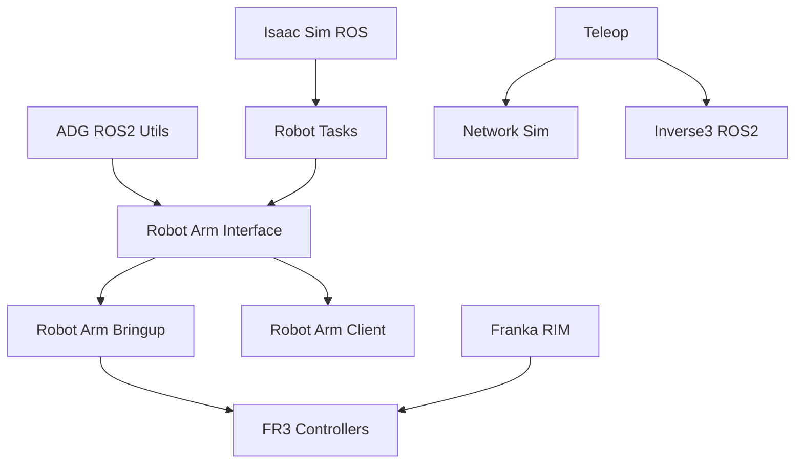

# ADG ROS2 Documentation

Welcome to the **Applied Dynamics Group ROS2** documentation! 
This guide covers all the ROS2 packages developed by the McGill Applied Dynamics Group for robotic systems, 
particularly focusing on the Franka Research 3 and teleoperation.

## Overview
The ADG ROS2 ecosystem consists of several interconnected packages:

- **[ADG ROS2 Utils](packages/adg-ros2-utils.md)**: Core utilities and debugging tools
- **[Robot Arm](packages/robot-arm.md)**: Complete robot arm control system including interfaces, controllers, and bringup
- **[Robot Tasks](packages/robot-tasks.md)**: Task execution framework with reinforcement learning capabilities
- **[Teleop](packages/teleop.md)**: Teleoperation system for remote robot control

## Quick Start

1. **Installation**: Follow our [installation guide](user-guide/installation.md)
2. **Getting Started**: Check out the [getting started guide](user-guide/getting-started.md)
3. **Examples**: Explore the [tutorials](tutorials/index.md)

## Key Features
- 🦾 **Robot Arm Control**: Complete control stack for Franka FR3 robot
- 🤖 **RL Integration**: Reinforcement learning task execution
- 🎮 **Teleoperation**: Remote control capabilities
- 🔧 **Debugging Tools**: Comprehensive debugging utilities
- 📚 **Well Documented**: Extensive API documentation

## System Requirements
- Ubuntu 22.04 LTS
- ROS2 Humble
- Python 3.10+

## Package Architecture

## Contributing

We welcome contributions! Please see our [contributing guide](developer-guide/contributing.md) for details on:

- Code style and standards
- Pull request process
- Issue reporting
- Development workflow

## Support

- 📖 Documentation: You're reading it!
- 🐛 Issues: [GitHub Issues](https://github.com/McGill-Applied-Dynamics-Group/adg-ros2/issues)
- 💬 Discussions: [GitHub Discussions](https://github.com/McGill-Applied-Dynamics-Group/adg-ros2/discussions)

---

*Made with ❤️ by the McGill Applied Dynamics Lab*
