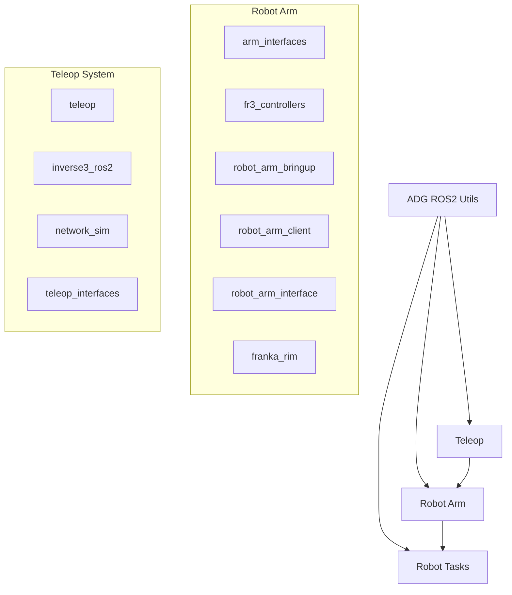

# Package Overview

The ADG ROS2 project consists of several interconnected packages, each serving specific functions in the robotic ecosystem.

## Core Packages

### [ADG ROS2 Utils](adg-ros2-utils.md)
**Location**: `adg_ros2_utils/`

Core utilities and debugging tools shared across all other packages.

- **Purpose**: Common functionality and debugging utilities
- **Language**: Python
- **Key Features**: Debug helpers, common interfaces

### [Robot Arm](robot-arm.md)
**Location**: `robot_arm/`

Complete robot arm control system including multiple sub-packages:

- **Purpose**: Robot arm control and interface
- **Languages**: C++, Python
- **Sub-packages**: 
  - `arm_interfaces`: Message and service definitions
  - `fr3_controllers`: Franka FR3 specific controllers
  - `robot_arm_bringup`: Launch files and configuration
  - `robot_arm_client`: Client interface for robot control
  - `robot_arm_interface`: Core interface definitions
  - `franka_rim`: Robot-in-the-middle simulation

### [Robot Tasks](robot-tasks.md)  
**Location**: `robot_tasks/`

Task execution framework with reinforcement learning capabilities.

- **Purpose**: High-level task execution and RL integration
- **Language**: Python
- **Key Features**: RL agents, task definitions, training utilities

### [Teleop](teleop.md)
**Location**: `teleop/`

Teleoperation system for remote robot control with multiple interfaces.

- **Purpose**: Remote robot control and teleoperation
- **Languages**: Python, C++
- **Sub-packages**:
  - `teleop`: Main teleoperation package
  - `inverse3_ros2`: Inverse kinematics utilities
  - `network_sim`: Network simulation tools
  - `teleop_interfaces`: Message definitions

## Package Dependencies



## Common Interfaces

All packages share common interfaces and message types:

### Standard ROS2 Messages
- `geometry_msgs`: Pose, twist, and spatial messages
- `sensor_msgs`: Joint states and sensor data
- `trajectory_msgs`: Joint and Cartesian trajectories
- `std_srvs`: Standard service definitions

### Custom Messages
- `arm_interfaces`: Robot arm specific messages and services
- `teleop_interfaces`: Teleoperation command interfaces

## Configuration

### Global Configuration
Configuration files are typically located in:
- `config/`: Package-specific configuration
- `launch/`: Launch file definitions
- `rviz/`: RViz visualization configurations

### Environment Variables
Common environment variables used across packages:
- `ROS_DOMAIN_ID`: ROS2 domain identifier
- `DEBUG_NODE`: Node name for debugging
- `DEBUG_PORT`: Debug port for remote debugging

## Development Workflow

### Building Individual Packages
```bash
# Build specific package
colcon build --packages-select adg_ros2_utils

# Build with dependencies
colcon build --packages-up-to robot_tasks
```

### Testing
```bash
# Test all packages
colcon test

# Test specific package
colcon test --packages-select robot_arm_interface
```

## Package Maintenance

### Version Management
Each package maintains its own version in `package.xml`:

```xml
<version>1.0.0</version>
```

### License
All packages use the same license structure defined in individual `LICENSE` files.

### Documentation
Each package contains:
- `README.md`: Package-specific documentation
- `CHANGELOG.md`: Version history and changes
- Code documentation via docstrings

## Next Steps

- Explore individual package documentation
- Check the [API Reference](../reference/) for detailed function documentation
- Review [Developer Guide](../developer-guide/contributing.md) for contribution guidelines
