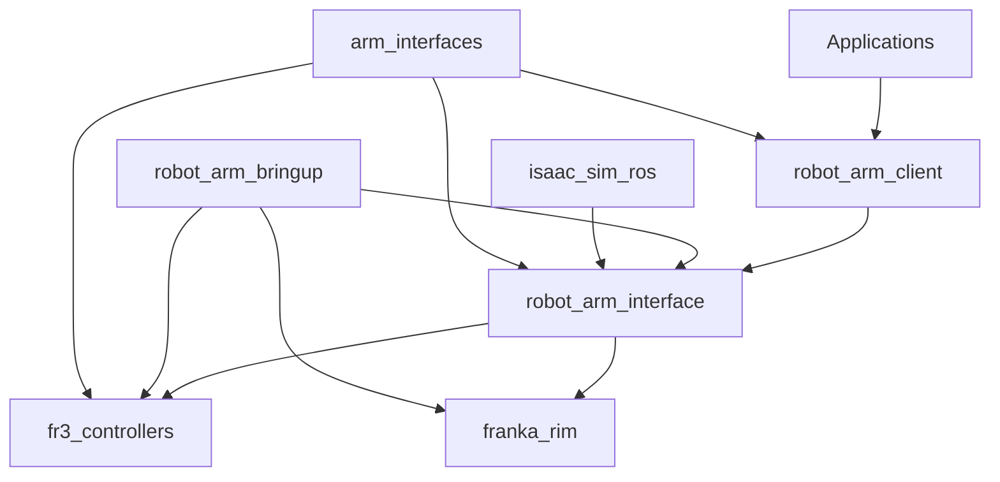

# Robot Arm Package

Complete robot arm control system including interfaces, controllers, and bringup configurations.

## Overview

The Robot Arm package is a comprehensive suite of sub-packages that provide complete robot arm control functionality. It includes everything from low-level controllers to high-level interfaces and simulation support.

## Sub-Packages

### Core Interface Packages

#### `arm_interfaces`
Message and service definitions specific to robot arm operations.

- **Purpose**: Custom ROS2 messages and services for arm control
- **Language**: ROS2 Interface Definition Language (IDL)
- **Key Features**: Joint commands, Cartesian commands, status messages

#### `robot_arm_interface`
High-level interface for robot arm control.

- **Purpose**: Unified interface for different robot arm types
- **Language**: Python
- **Key Features**: Abstracted control interface, safety monitoring

#### `robot_arm_client`
Client library for interacting with robot arm controllers.

- **Purpose**: Easy-to-use client interface for applications
- **Language**: Python
- **Key Features**: Simplified API, trajectory planning helpers

### Controller Packages

#### `fr3_controllers`
Specific controllers for the Franka FR3 robot arm.

- **Purpose**: Real-time controllers for FR3 hardware
- **Language**: C++
- **Key Features**: Joint control, Cartesian control, compliance control

#### `franka_rim`
Robot-in-the-Middle (RIM) system for Franka robots.

- **Purpose**: Simulation and testing framework
- **Language**: Python
- **Key Features**: Hardware-in-the-loop testing, delay simulation

### System Integration

#### `robot_arm_bringup`
Launch files and configuration for complete system startup.

- **Purpose**: System integration and deployment
- **Language**: Python (launch files)
- **Key Features**: Multi-robot support, configuration management

#### `isaac_sim_ros`
Integration with NVIDIA Isaac Sim for advanced simulation.

- **Purpose**: High-fidelity simulation environment
- **Language**: Python
- **Key Features**: Physics simulation, sensor simulation, RL environment

## System Architecture



## Quick Start

### Simulation Mode

Launch robot arm in simulation:

```bash
# Start Gazebo simulation
ros2 launch robot_arm_bringup gazebo.launch.py

# Control via interface
ros2 run robot_arm_client example_client.py
```

### Hardware Mode

Connect to real Franka FR3:

```bash
# Launch hardware interface
ros2 launch robot_arm_bringup franka_hardware.launch.py robot_ip:=192.168.1.100

# Run safety checks
ros2 service call /robot_arm_controller/check_safety std_srvs/srv/Trigger
```

## Key Features

### Safety Systems
- Joint limit monitoring
- Collision detection
- Emergency stop functionality
- Velocity and acceleration limiting

### Control Modes
- **Joint Control**: Direct joint position/velocity control
- **Cartesian Control**: End-effector pose control
- **Impedance Control**: Compliant interaction control
- **Trajectory Following**: Smooth trajectory execution

### Simulation Support
- Gazebo integration
- Isaac Sim support
- Hardware-in-the-loop testing
- Configurable physics parameters

## Configuration

### Robot Parameters

Key configuration files in `robot_arm_bringup/config/`:

- `robot_description.yaml`: Robot model parameters
- `controllers.yaml`: Controller configurations
- `safety_limits.yaml`: Safety parameter definitions

### Example Controller Configuration

```yaml
joint_trajectory_controller:
  type: joint_trajectory_controller/JointTrajectoryController
  joints:
    - joint_1
    - joint_2
    - joint_3
    - joint_4
    - joint_5
    - joint_6
    - joint_7
  command_interfaces:
    - position
  state_interfaces:
    - position
    - velocity
  constraints:
    goal_time: 0.5
    joint_1: {trajectory: 0.05, goal: 0.02}
    joint_2: {trajectory: 0.05, goal: 0.02}
```

## API Reference

For detailed API documentation, see:

- [Robot Arm Interface](../reference/robot_arm_interface/)
- [Robot Arm Client](../reference/robot_arm_client/)
- [FR3 Controllers](../reference/fr3_controllers/)

## Tutorials

- [Basic Robot Control](../tutorials/basic-robot-control.md)
- [Custom Controller Development](../tutorials/custom-controllers.md)
- [Hardware Integration](../tutorials/hardware-integration.md)

## Dependencies

### System Dependencies
- **ROS2 Humble**: Core ROS2 functionality
- **Gazebo**: Simulation environment
- **MoveIt2**: Motion planning framework
- **ros2_control**: Real-time control framework

### Hardware Dependencies
- **libfranka**: Franka robot interface library
- **Real-time Kernel**: For hardware control (recommended)

## Troubleshooting

### Common Issues

**Robot not responding to commands**
- Check that controllers are loaded: `ros2 control list_controllers`
- Verify robot state: `ros2 topic echo /robot_state`

**Simulation crashes on startup**
- Ensure Gazebo is properly installed
- Check graphics drivers for GPU acceleration

**Hardware connection fails**
- Verify network connection to robot
- Check robot IP address configuration
- Ensure user permissions for real-time scheduling

## Contributing

Each sub-package has its own development considerations:

- **C++ packages**: Follow ROS2 C++ style guidelines
- **Python packages**: Use type hints and docstrings
- **Interface packages**: Maintain backward compatibility

See the [contributing guide](../developer-guide/contributing.md) for detailed guidelines.

## License

Licensed under the terms specified in individual package LICENSE files.
