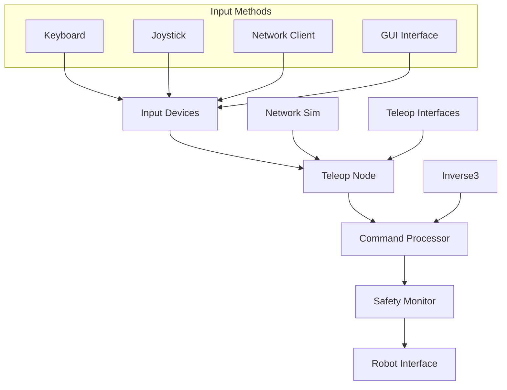

# Teleop (Teleoperation)

Remote robot control and teleoperation system with multiple interface options.

## Overview

The Teleop package provides comprehensive teleoperation capabilities for remote robot control. It supports multiple input methods including keyboard, joystick, and network-based interfaces, making it suitable for various use cases from development to production deployment.

## Sub-Packages

### Core Teleoperation

#### `teleop`
Main teleoperation package with core functionality.

- **Purpose**: Primary teleoperation interface and control logic
- **Language**: Python
- **Key Features**: Multi-input support, safety monitoring, command filtering

### Supporting Utilities  

#### `inverse3_ros2`
Inverse kinematics utilities for Cartesian control.

- **Purpose**: Real-time inverse kinematics computation
- **Language**: Python/C++
- **Key Features**: Multiple solver algorithms, singularity handling

#### `network_sim`
Network simulation and communication tools.

- **Purpose**: Network latency simulation and communication testing
- **Language**: Python  
- **Key Features**: Latency injection, packet loss simulation, bandwidth limiting

#### `teleop_interfaces`
Message and service definitions for teleoperation.

- **Purpose**: Custom ROS2 interfaces for teleop commands
- **Language**: ROS2 Interface Definition Language
- **Key Features**: Command messages, status feedback, configuration services

## System Architecture



## Supported Input Methods

### Keyboard Control
Direct keyboard input for quick testing and development.

```bash
# Launch keyboard teleoperation
ros2 run teleop teleop_keyboard

# Controls:
# WASD: Translation
# QE: Rotation around Z
# RF: Up/Down motion
# Space: Emergency stop
```

### Joystick/Gamepad
Xbox, PlayStation, and generic USB controllers.

```bash
# Launch with joystick support
ros2 launch teleop joystick.launch.py device:=/dev/input/js0

# Configure button mappings
ros2 param set /teleop_node button_emergency_stop 9
```

### Network Interface
Remote control over network connections.

```bash
# Start teleoperation server
ros2 launch teleop network_teleop.launch.py port:=8080

# Connect client
ros2 run teleop network_client --server=192.168.1.100:8080
```

### GUI Interface
Graphical interface for precise control.

```bash
# Launch GUI teleop interface
ros2 run teleop gui_teleop
```

## Control Modes

### Joint Control Mode
Direct joint angle control with individual joint sliders/inputs.

- **Use Case**: Precise joint positioning, robot calibration
- **Input**: Joint angle targets or velocities
- **Safety**: Joint limit checking, velocity limiting

### Cartesian Control Mode  
End-effector pose control in Cartesian space.

- **Use Case**: Intuitive end-effector positioning
- **Input**: Translation and rotation commands
- **Processing**: Inverse kinematics via `inverse3_ros2`

### Velocity Control Mode
Real-time velocity commands for smooth motion.

- **Use Case**: Continuous control, dynamic tasks
- **Input**: Linear and angular velocities
- **Safety**: Acceleration limiting, workspace boundaries

### Hybrid Control Mode
Combined joint and Cartesian control capabilities.

- **Use Case**: Complex manipulation tasks
- **Input**: Mixed command types
- **Coordination**: Priority-based command arbitration

## Configuration

### Device Configuration

Configure input devices in `config/devices.yaml`:

```yaml
keyboard:
  enabled: true
  key_mappings:
    'w': [0.0, 0.1, 0.0]  # Forward
    's': [0.0, -0.1, 0.0] # Backward
    'a': [-0.1, 0.0, 0.0] # Left
    'd': [0.1, 0.0, 0.0]  # Right
    
joystick:
  enabled: true
  device: "/dev/input/js0"
  deadzone: 0.1
  max_velocity: 0.5
  button_map:
    emergency_stop: 9
    mode_switch: 8
```

### Safety Configuration

Safety parameters in `config/safety.yaml`:

```yaml
safety:
  max_linear_velocity: 0.3    # m/s
  max_angular_velocity: 0.5   # rad/s
  max_acceleration: 1.0       # m/s²
  workspace_limits:
    x: [0.2, 0.8]
    y: [-0.5, 0.5] 
    z: [0.0, 0.6]
  emergency_stop_timeout: 1.0  # seconds
```

### Network Configuration

Network settings in `config/network.yaml`:

```yaml
network:
  server:
    host: "0.0.0.0"
    port: 8080
    max_clients: 5
    
  simulation:
    enabled: false
    latency_ms: 50
    packet_loss_rate: 0.01
    bandwidth_limit_kbps: 1000
```

## Quick Start

### Basic Keyboard Control

```bash
# Terminal 1: Launch robot system
ros2 launch robot_arm_bringup gazebo.launch.py

# Terminal 2: Start teleoperation
ros2 run teleop teleop_keyboard
```

### Joystick Setup

```bash
# Check joystick device
ls /dev/input/js*

# Test joystick input  
jstest /dev/input/js0

# Launch with joystick
ros2 launch teleop joystick.launch.py device:=/dev/input/js0
```

### Network Teleoperation

```bash
# Server side (robot)
ros2 launch teleop network_server.launch.py

# Client side (operator)
ros2 run teleop network_client --server=ROBOT_IP:8080
```

## Safety Features

### Emergency Stop
Multiple emergency stop mechanisms:

- Hardware emergency stop button
- Software emergency stop command
- Communication timeout protection
- Workspace boundary enforcement

### Command Filtering
Real-time command validation:

- Velocity and acceleration limiting
- Workspace boundary checking
- Joint limit enforcement
- Collision avoidance (if configured)

### Monitoring
Continuous system monitoring:

- Communication latency tracking
- Command frequency monitoring
- Robot status verification
- Operator presence detection

## Network Simulation

The `network_sim` package provides tools for testing teleoperation under various network conditions:

### Latency Simulation

```python
from network_sim.latency import LatencySimulator

# Add 100ms latency
sim = LatencySimulator(latency_ms=100)
sim.start()

# Commands will now have added delay
```

### Bandwidth Limiting

```bash
# Limit to 56k modem speeds
ros2 run network_sim bandwidth_limiter --rate=56kbps
```

### Packet Loss Simulation

```python
from network_sim.packet_loss import PacketLossSimulator

# Simulate 5% packet loss
sim = PacketLossSimulator(loss_rate=0.05)
```

## API Reference

### Core Teleoperation Classes

#### TeleopNode
Main teleoperation node handling input processing and command generation.

```python
from teleop.teleop_node import TeleopNode

node = TeleopNode()
node.set_control_mode('cartesian')
node.enable_safety_monitoring(True)
```

#### InputManager
Manages multiple input sources and command fusion.

```python
from teleop.input_manager import InputManager

manager = InputManager()
manager.add_input_source('keyboard', KeyboardInput())
manager.add_input_source('joystick', JoystickInput('/dev/input/js0'))
```

### Safety Systems

#### SafetyMonitor
Real-time safety checking and emergency stop functionality.

```python
from teleop.safety import SafetyMonitor

safety = SafetyMonitor()
safety.set_workspace_limits(x=[0.2, 0.8], y=[-0.5, 0.5], z=[0.0, 0.6])
is_safe = safety.validate_command(command)
```

## Inverse Kinematics Integration

The `inverse3_ros2` package provides inverse kinematics support:

### Solver Configuration

```yaml
inverse_kinematics:
  solver: "kdl"  # or "trac_ik", "bio_ik"
  timeout: 0.005  # seconds
  epsilon: 1e-5   # solution tolerance
  num_attempts: 3
```

### Usage Example

```python
from inverse3_ros2.solver import IKSolver

solver = IKSolver("robot_description")
joint_angles = solver.solve(target_pose, seed_joints)
```

## Custom Input Development

### Creating Custom Input Sources

```python
from teleop.input_base import InputBase

class CustomInput(InputBase):
    def __init__(self, config):
        super().__init__(config)
        # Initialize custom hardware
        
    def read_input(self):
        """Return command vector [x, y, z, rx, ry, rz]."""
        # Read from custom device
        return command_vector
        
    def is_emergency_stop(self):
        """Check for emergency stop condition."""
        return emergency_pressed
```

### Registration

```python
from teleop.input_manager import register_input_type
register_input_type("custom", CustomInput)
```

## Performance Optimization

### Low Latency Mode

```yaml
performance:
  low_latency_mode: true
  command_frequency: 100  # Hz
  buffer_size: 1
  priority: "RT_FIFO"
```

### Resource Management

```python
# Set CPU affinity for real-time performance
import os
os.sched_setaffinity(0, {1})  # Use CPU core 1

# Set thread priority
import threading
threading.current_thread().priority = threading.THREAD_PRIORITY_TIME_CRITICAL
```

## Monitoring and Diagnostics

### Performance Metrics

```bash
# Monitor teleoperation performance
ros2 topic echo /teleop_node/diagnostics
```

### Latency Measurement

```python
from teleop.diagnostics import LatencyMonitor

monitor = LatencyMonitor()
latency = monitor.get_average_latency()  # milliseconds
```

## Integration with Robot Arm

Seamless integration with the robot arm system:

```python
from robot_arm_interface import RobotArmInterface
from teleop.teleop_node import TeleopNode

# Connect teleoperation to robot
robot = RobotArmInterface()
teleop = TeleopNode(robot_interface=robot)

# Commands are automatically forwarded
teleop.start()
```

## Troubleshooting

### Common Issues

**Joystick not detected**
- Check device permissions: `sudo chmod 666 /dev/input/js0`
- Verify device existence: `ls -l /dev/input/js*`

**High latency in network mode**
- Check network configuration
- Reduce command frequency
- Enable compression

**Emergency stop not working**
- Verify safety configuration
- Check input device mapping
- Test hardware emergency stop

**Commands not reaching robot**
- Check topic connections: `ros2 topic list`
- Verify robot interface status
- Check safety system status

## Testing

### Unit Tests

```bash
# Test input processing
python3 -m pytest test/test_input_manager.py

# Test safety systems  
python3 -m pytest test/test_safety_monitor.py
```

### Integration Tests

```bash
# Test with mock robot
ros2 launch teleop test_integration.launch.py use_mock_robot:=true

# Test network simulation
ros2 launch teleop test_network_sim.launch.py
```

## Contributing

When contributing to the teleoperation system:

- Test with multiple input devices
- Verify safety system behavior
- Check network performance
- Document new input types

See the [contributing guide](../developer-guide/contributing.md) for detailed guidelines.

## License

Licensed under the same terms as the main ADG ROS2 project.
