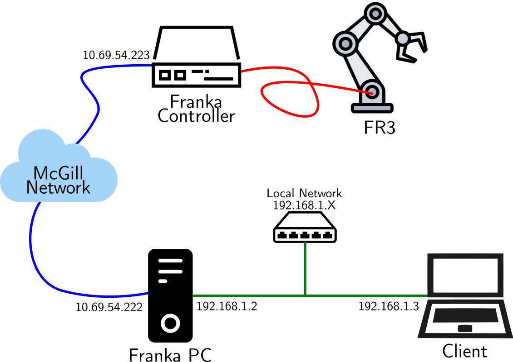

# Getting Started

This guide will help you get up and running with the ADG ROS2 packages and basic functionalities of the Franka Arm. 

> TIP: **Glossary**
>
> - **Franka Control** / **Controller**: Black Box on the table
> - **Franka PC** / **Desktop**: Franka PC on the ground
> - **Franka Desk**: Web app to control the robot
> - **FR3-server**: Set of ros2 nodes to publish the robot states and send position commands. Running on the *Franka PC*.

> INFO: **General Info**
> Model: Franka Research 3
> - - -
> **IPs**
>
> - Controller IP: 10.69.54.223
> - Franka Desktop: 10.69.54.222
>
> - - -
> **ROS2**
> 
> - ROS2 Version: humble
> - Domain: 01

> NOTE: Useful Resources
> 
> - [Documents](https://franka.de/documents)
> 	- [Datasheet](https://download.franka.de/documents/Datasheet%20Franka%20Research%203_R02212_1.2_EN.pdf)
> 	- [Product manual](https://download.franka.de/documents/Product%20Manual%20Franka%20Research%203_R02210_1.1_EN.pdf)
> 	- [Franka hand ](https://download.franka.de/documents/Product%20Manual%20Franka%20Hand_R50010_1.1_EN.pdf)
> - [FCI Documentation](https://frankarobotics.github.io/docs/index.html)
> - [FCI API Doc (c++)](https://frankarobotics.github.io/libfranka/0.15.0/)
> - [DH Parameters](https://frankaemika.github.io/docs/control_parameters.html#denavithartenberg-parameters)
> - [FR3 Limits](https://frankaemika.github.io/docs/control_parameters.html#limits-for-franka-research-3)

## Network Setup
<figure markdown="span">
  { width="500" }
  <figcaption>Network Setup</figcaption>
</figure>

## 1. Robot Startup
1. Power on the *Franka Controller*

2. Open *Franka Desk*
	- You have two options: on the **Franka PC** or via **SSH** (recommended)

    - **On the *Franka PC***
        - Open a session using the monitor connected to the PC
            - User: csirois, pwd: FrankaPC2024
        - In a browser, go to *10.69.54.223*
    - **Using SSH on your laptop**
        - Follow the [ssh setup user guide](./ssh-setup.md)
        - SSH to the FrankaPC with the tunnelling option
        ```
        ssh franka-pc
        ```
        - In your browser, open desk [https://localhost:8443/desk/](https://localhost:8443/desk/)

3. Unlock the joints

4. Activate FCI

## 2. Franka Server
See [Franka Server User Guide](./franka-server.md) for a comprehensive guides on the **Franka Server** 
functionalities.

## 3. Using the Client (ADL ROS2 Packages)
The ADL ROS2 packages provide various way for controlling the FR3. The easiest is to use the `arm_client`, a wrapper
around the ROS2 functionalities to directly specify robot motion. 

For the following steps, we assume the server is running and you have the ADL ROS2 packages installed. 

TODO: Project structure

### Arm Client - Python Scripting
Look at the `scripts` folder of the 
[arm_client](https://github.com/McGill-Applied-Dynamics-Lab/adl-ros2/tree/DelayRIM/src/arm_client/scripts) for examples
of commands you can send. 

You can send the robot home with: 
```
python src/arm_client/scripts/00_home.py
```


### Teleoperation

Teleoperation of the arm... 


### Robot Tasks

To run RL agents ...


## Next Steps

- Explore the [API Reference](../reference/) for detailed documentation
- Check out the [Tutorials](../tutorials/) for step-by-step examples
- Review the [Developer Guide](../developer-guide/contributing.md) if you want to contribute
